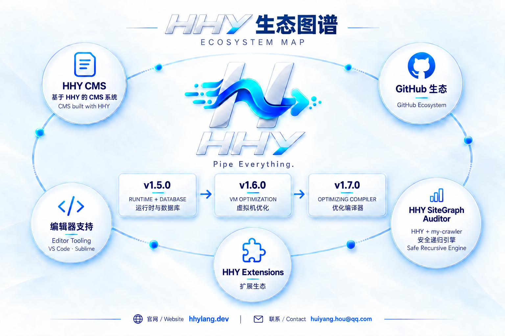

<p align="center">
  
</p>

<h1 align="center">HHY Language</h1>
<p align="center"><strong>Pipe Everything.</strong></p>
<p align="center">用同一种数据流模型，连接文件、进程、网络与结构化数据。</p>

<p align="center"><a href="README.md">English</a> · <strong>中文</strong></p>

<p align="center">
  <a href="https://hhylang.dev/zh">官网</a> ·
  <a href="https://hhylang.dev/zh/learn">语言手册</a> ·
  <a href="docs/README.md">文档中心</a> ·
  <a href="https://github.com/hh696-wq/hhy-vm/releases/latest">下载</a> ·
  <a href="docs/HHY_V1.en.md">English specification</a>
</p>

<p align="center">
  <a href="VERSION"></a>
  <a href="https://github.com/hh696-wq/hhy-vm/actions/workflows/ci.yml"></a>
  <a href="LICENSE"></a>
</p>

HHY 是一门用 C 实现的系统脚本语言，围绕 `source |> transform |> action` 组织程序，适合文件处理、数据采集、自动化与 Web 服务。语言具有明确的语法、类型规则、执行语义和退出码。

| 特性 | 作用 |
| --- | --- |
| Flow-first | 用 `\|>` 组合数据源、转换、过滤与最终操作 |
| 系统能力 | 直接操作文件、进程、HTTP、JSON、CSV 和文件监听 |
| 完整脚本语义 | 变量、函数、闭包、分支、循环、模块与结构化错误 |
| 原生单位 | 使用 `10mib`、`500ms`、`2h`、`80%` 表达容量、时间与比例 |
| 有界执行 | 惰性 Stream、有界并发、取消、资源限制和脱敏 dry-run |

[快速开始](#快速开始) · [语言一览](#语言一览) · [Web 与扩展](#web-与扩展) · [命令行工具](#命令行工具) · [当前版本](#当前版本) · [开发与文档](#开发与文档)

## 快速开始

### 1. 安装

macOS arm64、Linux arm64 / x86_64：

```sh
curl -fsSL https://hhylang.dev/install.sh | sh
export PATH="$HOME/.local/bin:$PATH"
hhy --version
```

安装器自动选择平台包并校验 SHA-256。[查看安装脚本](install.sh) · [完整安装说明](INSTALL.md)

<details>
<summary>其他安装方式：Homebrew、手动下载、源码构建</summary>

**Homebrew（macOS arm64）**

```sh
brew tap hh696-wq/hhy https://github.com/hh696-wq/hhy-vm.git
brew install hhy
```

**手动下载**

从 [GitHub Releases](https://github.com/hh696-wq/hhy-vm/releases/latest) 下载对应平台归档，按 `.sha256` 或 `SHA256SUMS` 校验。解压后保留 `bin/` 与 `lib/` 的相对位置，通过 `./bin/hhy` 运行。

Windows x86_64 使用 MSYS2 发行包，包内不含 Database 扩展。

**从源码构建（macOS 示例）**

```sh
brew install curl pcre2 bdw-gc jansson openssl@3 zlib
git clone https://github.com/hh696-wq/hhy-vm.git
cd hhy-vm
make
./build/hhy --version
```

Linux 依赖、安装路径及官方扩展的额外构建依赖见 [INSTALL.md](INSTALL.md) 和[依赖说明](docs/DEPENDENCIES.md)。

</details>

### 2. 编写脚本

创建 `hello.hhy`：

```hhy
let language = "HHY"

["Flow", "Pipe", "System"]
    |> map { word -> "{language}: {word}" }
    |> print
```

### 3. 检查并运行

```sh
hhy check hello.hhy
hhy run hello.hhy
```

下载或克隆仓库后，也可以运行 `hhy run examples/07-language-basics.hhy`。更多入门内容见[在线快速开始](https://hhylang.dev/zh/learn/quick-start)。

## 语言一览

### 文件与文本

读取日志，筛选包含 `ERROR` 的前 20 行。运行前需准备 `./logs` 目录及日志文件。

```hhy
path("./logs")
    |> files("**/*.log")
    |> flat_map { file -> read_lines(file.path) }
    |> where { line -> contains(line, "ERROR") }
    |> take(20)
    |> print
```

### HTTP 与 JSON

为请求设置超时与重试，再解析响应。`https://example.com/users` 是占位地址，运行时替换为返回 JSON 的接口。

```hhy
http.get("https://example.com/users")
    |> timeout(5s)
    |> retry(3)
    |> send
    |> response_body
    |> parse_json
    |> print
```

### 有界并发

并发处理两个请求，并保持输入顺序输出结果。

```hhy
["https://example.com", "https://example.org"]
    |> parallel(2) { url ->
        http.get(url)
            |> timeout(5s)
            |> send
    }
    |> print
```

### 进程查询

查找内存占用超过 1 GB 的进程，按占用量降序取前 10 项。需要宿主允许读取进程信息。

```hhy
processes
    |> where { process -> process.memory > 1gb }
    |> sort_by({ order: "desc" }) { process -> process.memory }
    |> take(10)
    |> print
```

更多场景见 [examples](examples/README.md)。README 中的完整 HHY 代码块由 CI 使用 Parser 和 Checker 检查；网络和文件示例运行时还需要相应输入与宿主能力。

## Web 与扩展

| 能力 | 当前支持 | 详细说明 |
| --- | --- | --- |
| Web Runtime | 常驻应用、Router、Middleware、静态文件、上传、SSE、Range、多 Worker 和指标 | [Web API 与部署](docs/WEB_RUNTIME.md) |
| Database 1.0.0 | MySQL/PostgreSQL、TLS、有界连接池、事务/保存点、预处理、游标与 HHY Stream | [Database API](extensions/database/README.md) |
| HTML | HTML5 容错解析、CSS Selector 与结构化抽取 | [HTML 扩展](extensions/html/README.md) |
| 扩展工具链 | 进程隔离、权限声明、签名 Registry、锁定、离线安装与回滚 | [扩展入口](extensions/README.md) · [Registry 协议](docs/EXTENSION_REGISTRY_V1.md) |

运行仓库中的 Web 示例：

```sh
hhy serve examples/10-web-api.hhy -- 8080
hhy serve --dev examples/10-web-api.hhy -- 8080
```

Web 的 TLS 和 HTTP/2 由反向代理承担。Database 远程连接需要显式配置和端点授权；RDS 实机及 24 小时长稳尚未宣称验证通过。完整边界见[已知限制](docs/KNOWN_LIMITATIONS.md)。

## 命令行工具

| 常用命令 | 用途 |
| --- | --- |
| `hhy run <script.hhy> [args...]` | 运行脚本 |
| `hhy check <file.hhy>...` | 检查语法和核心语义 |
| `hhy fmt <file.hhy>...` | 格式化源码 |
| `hhy repl` | 启动交互式环境 |
| `hhy run --dry-run <file.hhy>` | 生成脱敏执行计划 |
| `hhy profile <script.hhy>` | 分析 CPU、调用次数和托管 Heap |
| `hhy serve <app.hhy> [args...]` | 启动常驻 Web 应用 |
| `hhy --help` | 查看完整参数与资源限制选项 |

<details>
<summary>扩展管理、机器可读诊断与编译器调试</summary>

| 命令 | 用途 |
| --- | --- |
| `hhy install <local-path>` | 校验并安装本地进程扩展 |
| `hhy install --registry DIR --trust-root FILE <namespace/name>` | 验签、解析依赖并安装扩展 |
| `hhy lock --registry DIR --trust-root FILE <namespace/name>` | 写入锁定图 |
| `hhy fetch --locked ...` | 缓存锁定的依赖 |
| `hhy install --locked --offline ... <namespace/name>` | 离线重建依赖 |
| `hhy install --upgrade ...` / `hhy rollback <package>` | 升级或回滚 |
| `hhy doctor extensions` | 检查安装状态、lock 与 cache |
| `hhy list` / `hhy remove <package>` | 列出或移除扩展 |
| `hhy check --format json <file.hhy>...` | 输出结构化诊断 |
| `hhy contracts --format json` | 输出 Callable Contract Registry |
| `hhy bytecode <file.hhy>` | 编译、验证并反汇编，不执行程序 |
| `hhy bytecode --metrics <file.hhy>` | 输出编译、验证和准备阶段指标 |
| `hhy ast <file.hhy>` / `hhy tokens <file.hhy>` | 查看 AST 或 Token |

这些 JSON 接口可供编辑器和自动化工具消费。编辑器插件源码与完整应用案例不随 Core 主仓分发。

</details>

性能报告默认写入 stderr，保留脚本 stdout。也可以保存为 JSON：

```sh
hhy profile --heap --format json --output profile.json script.hhy
```

短任务的 CPU 样本可能不足；Heap 指标仅反映 HHY 托管内存，不包含扩展进程或原生库自行分配的内存。[性能分析与优化开关](docs/CURRENT_VERSION.md)

## 当前版本

当前 Core 为 **1.7.0**，语言规范保持 **1.0.0** 冻结，Database 扩展独立版本为 **1.0.0**。

| 范围 | 状态 |
| --- | --- |
| 默认执行 | 经 Compiler/Verifier 验证的 Bytecode；永久保留 `--engine ast` 回退 |
| 可选优化 | 结构化 HIR、六个静态 pass、整数 MIR、参数反馈 guard/deopt 与局部 List 标量替换 |
| 启用方式 | `HHY_COMPILER=ir`、`HHY_FEEDBACK_SPECIALIZATION=1`、`HHY_SCALAR_REPLACEMENT=1` 显式启用，具体依赖见使用指南 |
| 性能边界 | 新优化默认关闭；正确性和发行验收通过，不等于真实负载普遍提速 |
| 资源边界 | List 标量替换保留 GC/配额分配预约，不代表物理堆分配消除 |
| Bytecode 缓存 | 尚未准入；不提供持久 `.hhyc`、外部预编译 Bytecode 加载器或公开 Bytecode ABI |

### 主要里程碑

| 版本阶段 | 交付内容 |
| --- | --- |
| v1.1–v1.2 | 诊断工具、进程扩展、可信分发、lock/离线/回滚与 HTML 验证 |
| v1.3 | Bytecode VM；1.3.5 起默认执行，后续完善 Stream Kernel、Profiler 与缓存治理 |
| v1.4 | Web Runtime，统一通过 1.4.3 交付 |
| v1.5 | Database 1.0.0 与 Runtime 集成 |
| v1.6–v1.7 | Runtime 画像/实验和优化编译器，统一通过 1.7.0 交付 |

v1.6.x 和部分 v1.7.x 编号表示工程子阶段，不是独立可安装版本。详细变更见 [GitHub Releases](https://github.com/hh696-wq/hhy-vm/releases)，下一阶段安排见[公共路线图](docs/ROADMAP.md)。

<details>
<summary>查看 HHY 生态图谱</summary>



图中版本表示能力演进阶段，具体发行与默认启用状态以上表和发行说明为准。

</details>

## 开发与文档

主仓包含语言实现、SDK、官方扩展、测试、基准与公开文档。完整案例、编辑器、官网和原始性能报告独立维护；必要的工作负载回归程序保留在 `tests/workloads/`。

| 目的 | 入口 |
| --- | --- |
| 安装、学习和查语法 | [安装说明](INSTALL.md) · [文档中心](docs/README.md) · [中文规范](docs/HHY_V1.md) · [English specification](docs/HHY_V1.en.md) |
| 理解 VM 与编译器 | [Bytecode](docs/BYTECODE.md) · [Compiler IR](docs/architecture/COMPILER_IR.md) |
| 理解 Runtime 实验 | [调用与展开](docs/architecture/VM_CALL_RUNTIME.md) · [Inline Cache](docs/architecture/VM_INLINE_CACHE.md) · [GC 与调度](docs/architecture/VM_GC_SCHEDULER.md) |
| 修改代码与验证 | [贡献指南](CONTRIBUTING.md) · [Runtime 治理](docs/RUNTIME_GOVERNANCE.md) · [工作负载回归](tests/workloads/README.md) |
| 查看验证与边界 | [GitHub Actions](https://github.com/hh696-wq/hhy-vm/actions/workflows/ci.yml) · [已知限制](docs/KNOWN_LIMITATIONS.md) · [安全报告](SECURITY.md) |

## 许可证

HHY Language 使用 [Apache License 2.0](LICENSE)。分发时请遵守许可证与 [NOTICE](NOTICE) 的要求；第三方依赖适用各自的许可证，详见[第三方声明](docs/THIRD_PARTY_NOTICES.md)。

<p align="center"><strong>Built solo. Designed to flow.</strong></p>
